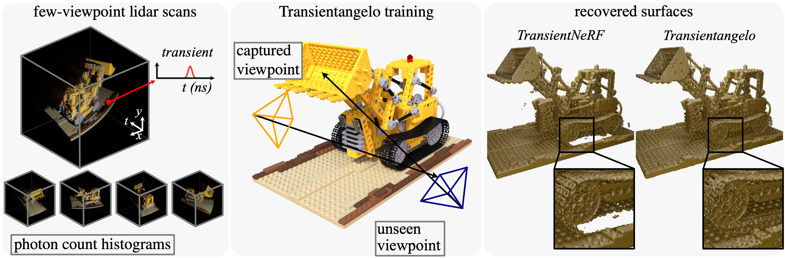

# Transientangelo: Few-Viewpoint Surface Reconstruction Using Single-Photon Lidar 



## 🔨 Installation

1. Create a new conda environment (make sure miniconda3 is installed beforehand). We tested on python version 3.8.13
```
conda create -n env_name python=3.8.13
conda activate env_name
```
2. Additionally please install PyTorch from (https://pytorch.org/get-started/previous-versions/). We tested on pytorch1.13.0 with cuda11.6. Be aware of some issues between NerfAcc and other Pytorch versions here: https://github.com/nerfstudio-project/nerfacc/issues/207

```
# torch 1.13.0+cu116
conda install pytorch==1.13.0 torchvision==0.14.0 torchaudio==0.13.0 pytorch-cuda=11.6 -c pytorch -c nvidia
```
3. Install tinycudann (https://github.com/NVlabs/tiny-cuda-nn)
```
pip install git+https://github.com/NVlabs/tiny-cuda-nn/#subdirectory=bindings/torch
```

4. Install the requirements file with 

```
pip install -r requirements.txt
```

4. Install torch-scatter using conda
```
conda install pytorch-scatter -c pyg
```

5. Install
## 🖨️ Dataset 


## 👨‍🍳 Usage

### Memory Usage 
All experiments are ran on a single RTXA6000 GPU with 48GB of memory. There are a couple ways to reduce the memory usage to fit on smaller GPUs. For instance, you can reduce the size of the model (i.e. reducing `model.geometry.xyz_encoding_config.log2_hashmap_size`). Furthermore, you can also skip evaluation by setting `trainer.val_check_interval` to a value larger than `trainer.max_steps`. 


### Training
The training command structure will be as follows:
```
python launch.py --config <CONFIG_PATH> --gpu <GPU_ID> --train dataset.scene=<SCENE> dataset.num_views=<NUM_VIEWS>
```
Two main configs: transient-neuralangelo-blender.yaml and transient-neuralangelo-captured.yaml are our configs for the simulated and captured dataset, respectively. On the low photon experiments, please use the `transient-neuralangelo-blender{PHOTON_LEVEL}.yaml` and `transient-neuralangelo-captured{PHOTON_LEVEL}.yaml`. In the current code base, evaluation will follow immediately after training. 

### Evaluation
If you decide to run evaluation, you will be using this command structure:
```
python launch.py --config <CONFIG_PATH> --gpu <GPU_ID> --resume <CKPT_PATH> --test dataset.scene=<SCENE> dataset.num_views=<NUM_VIEWS>
```
The <CKPT_PATH> will be the checkpoint path ending with ckpt.


### Reproducing numbers
To reproduce baseline numbers, run the evaluation script with the corresponding checkpoint and corresponding config files (e.g. `regnerf-baseline-blender.yaml` for RegNeRF on the simulated dataset, etc.)


### Making 360 degrees videos
For the 360 degrees videos, you first need a trained model. Then, simply use the evaluation command structure (with the corresponding config path) and append `dataset.name=captured-movie system.name=movie-system` for the captured dataset and `dataset.name=blender-movie system.name=movie-system` for the simulated dataset.

### Simple config settings
The default config settings can be customized:
-`config.model.ray_chunk` controls the size of the chunk of rays that is being used for rendering during eval. You can decrease/increase this number to accelerate the validation/testing step. Select divisors of 262144 (since the image size is 512x512).


## 🎓 Citation
```
@inproceedings{luo2024transientangelo,
  title = {Transientangelo: Few-Viewpoint Surface Reconstruction Using Single-Photon Lidar}, 
  author = {Luo, Weihan and Malik, Anagh and Lindell, David B.},
  journal = {arXiv},
  year = {2024}
}
```

## 🔧 General troubleshooting advice
| Problem                                     | Solution                                                                                                       |
|---------------------------------------------|---------------------------------------------------------------------------------------------------------------|
| Program freezes during ray marching.        | Delete the cache located at `~/.cache/torch_extensions/` (see [issue #260](https://github.com/nerfstudio-project/nerfacc/issues/260)) |
| RuntimeError: CUDA error: invalid configuration argument       | This error seems to be present in pytorch versions 1.12.1+cuda11.6, please switch to pytorch 1.13.0 (see [issue #207](https://github.com/nerfstudio-project/nerfacc/issues/207))  |


## 📣 Acknowledgements
We thank [TransientNeRF](https://github.com/anaghmalik/TransientNeRF) for their implementation of transient volume rendering. We thank [NerfAcc](https://www.nerfacc.com) and [instant-nsr-pl](https://github.com/bennyguo/instant-nsr-pl) for their implementation efficient ray marching and surface-based rendering.
